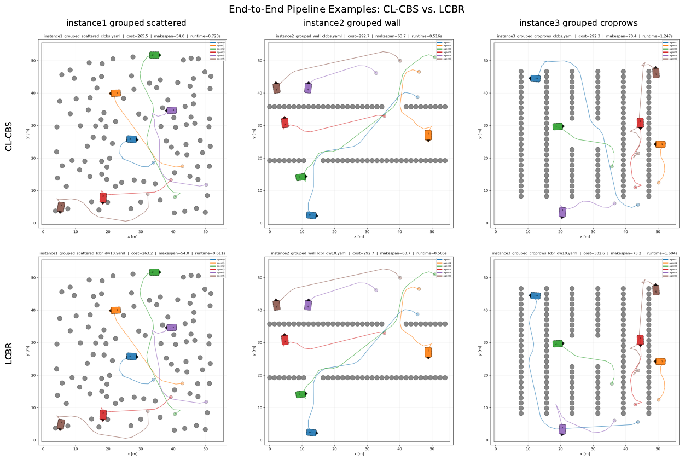

# LCBR

**Local Conflict-Based Trajectory Repair** for multi-UGV coordination,
built on top of CL-CBS (Wen et al., 2022). Implements the pipeline
described in *"Stage 1 -- UGV Coordination and Task Allocation"*: nominal
trajectory generation, trajectory-cost-based task allocation, and
multi-robot conflict resolution for a fleet of Ackermann-steered UGVs.

<p align="center">
  
</p>

<p align="center"><em>
Three example instances taken through the full Stage 1 &rarr; 2 &rarr; 3
pipeline. LCBR (bottom) reaches the same or a comparable solution to
CL-CBS (top) while resolving conflicts through bounded local repair
instead of full-horizon replanning.
</em></p>

**New here?**
- Algorithm-to-code mapping: [`docs/LCBR.md`](docs/LCBR.md)
- Running an experiment end-to-end: [`docs/EXPERIMENTS.md`](docs/EXPERIMENTS.md)
- Known gaps, empirical gotchas, exact build environment: [`docs/REPRODUCIBILITY.md`](docs/REPRODUCIBILITY.md)
- What each `runs/` folder in this repo actually contains: [`runs/README.md`](runs/README.md)

The conflict-resolution stage supports two interchangeable strategies,
selected with `--mode`:

- `clcbs` -- the CL-CBS baseline: full-horizon low-level replanning on
  every branch of the Body Conflict Tree.
- `lcbr` (default) -- **Local Conflict-Based Trajectory Repair**, this
  project's contribution: a bounded low-level query around the detected
  conflict, with the original full-horizon query retained as fallback.

Both strategies run through the *exact same* BCT search loop
(`include/body_conflict_tree.hpp`) and the *exact same* SHA* engine
(`include/hybrid_astar.hpp`, unmodified from CL-CBS) -- only the function
called to replan a constrained robot differs. This is deliberate: it is
what makes the experimental comparison between the two an ablation rather
than a comparison of two different codebases.

## Repository layout

```
LCBR/
├── include/               C++ headers -- the pipeline itself (see docs/LCBR.md)
├── src/                   main() -- Stage 1 -> 2 -> 3
├── config/
│   ├── vehicle_config.yaml         vehicle/algorithm parameters (Table 0)
│   └── experiments/*.yaml          one declarative config per experiment
├── benchmark/             Wen et al.'s benchmark goes here locally (gitignored,
│                          not committed -- see benchmark/README.md)
├── experiments/           per-experiment run scripts (read config/experiments/*.yaml)
│   ├── main_comparison/
│   ├── delta_w_ablation/           supports --parallel N; select_conflict_instances.py
│   │                                for a conflict-targeted (not random) instance pick
│   ├── full_pipeline/
│   └── real_instances/             3 real 6-robot instances (crop rows / scattered
│                                    walls / grouped-scattered obstacles)
├── runs/                  raw outputs, one folder per run_id (gitignored, see
│                          runs/README.md for what's normally in here)
├── analysis/
│   ├── analysis.ipynb              the main analysis notebook -- start here
│   ├── validate_all_runs.py        batch C3b/C4/C5 validation across every
│   │                                discovered run in one combined report
│   └── *.py                        individual table/figure derivation scripts
├── results/
│   ├── tables/            paper-ready CSVs (gitignored, regenerate from runs/)
│   └── figures/           paper-ready PDFs (gitignored, regenerate from runs/)
├── docs/
│   ├── images/                     the one pipeline image kept in the repo
│   │                                (README only -- everything else is regenerated)
│   ├── LCBR.md, EXPERIMENTS.md, REPRODUCIBILITY.md
├── tests/                 CTest: 1 real unit test, 1 black-box smoke test,
│                          4 documented stubs (see docs/REPRODUCIBILITY.md)
└── tools/                 visualize.py (original), visualize_v2.py (primary,
                           user-provided), generate_instance.py (user-provided)
```

## Relationship to CL-CBS

Built directly on top of CL-CBS's low-level machinery (Wen et al.,
*"CL-MAPF: Multi-Agent Path Finding for Car-Like robots with kinematic and
spatiotemporal constraints"*, RAS 2022,
[github.com/APRIL-ZJU/CL-CBS](https://github.com/APRIL-ZJU/CL-CBS)).

| File | Status |
|---|---|
| `include/neighbor.hpp`, `planresult.hpp`, `timer.hpp`, `hybrid_astar.hpp` | unmodified (+ doc comments; `hybrid_astar.hpp` additionally gained an optional expansion cap and a defensive goal-lookup guard, see `docs/REPRODUCIBILITY.md`) |
| `include/environment.hpp` | adapted: local-goal override, per-call expansion counters, exposed `checkStateValid`. Every diff against the original is marked inline with `[LCBR]`/`[LOG]` comments. |
| `include/low_level_environment.hpp` | new (factored out of CL-CBS's `cl_cbs.hpp`, shared by both query types) |
| `include/task_allocation.hpp` | new: Stage 1 (nominal generation helpers) + Stage 2 (Hungarian LAP) |
| `include/local_repair.hpp` | new: **LCBR**, Algorithm 1 |
| `include/body_conflict_tree.hpp` | new: Algorithm 2, generalizes CL-CBS's `cl_cbs.hpp` to a runtime-selectable low-level strategy |
| `include/experiment_logger.hpp` | new: query-level / instance-level CSV logging |
| `src/ugv_coordination.cpp` | new: Algorithm 3, concrete `State`/`Constraint`/... types (same pattern as the original `src/cl_cbs.cpp`) |
| `tools/visualize.py` | unmodified (copied from CL-CBS) |
| `tools/visualize_v2.py` | primary visualization tool. Rounded car body + directional nose triangle, tab20 palette, legend/title/grid/axis labels, `--static` (single PNG, full paths), `--compare` (side-by-side solver comparison, consistent per-agent colors), GIF export via pillow (no ffmpeg needed). Supports both the original `agents:` schema and this project's `robots:`/`pois:` schema. |
| `tools/generate_instance.py` | generates `robots:`/`pois:`/`map:` instances with a choice of 9 obstacle patterns and 4 start-placement modes, with optional real-planner validation of every start/goal (`--build-dir`/`--vehicle-config`) |
| `analysis/euclidean_ablation.py` | Sec. 5.6 mini-ablation -- SHA*-derived vs Euclidean-distance assignment, both priced on the real M x Q cost matrix (`--cost-matrix-csv`) |
| `analysis/validate_all_runs.py` | independent C3b/C4/C5 re-validation across every discovered `runs/main_comparison/` batch, combined into one report |

## Build

```bash
sudo apt-get install g++ cmake libboost-program-options-dev libyaml-cpp-dev libompl-dev libeigen3-dev
mkdir build && cd build
cmake -DCMAKE_BUILD_TYPE=Release ..
make -j$(nproc)
ctest --output-on-failure   # 2 tests: test_task_allocation, smoke_test
```

Produces `build/ugv_coordination`. See `docs/REPRODUCIBILITY.md` for the
exact toolchain versions this was last validated against.

## Quick smoke test

```bash
cd build
./ugv_coordination -i ../experiments/full_pipeline/instances/instance1_grouped_scattered.yaml \
    -o /tmp/out.yaml --mode lcbr --vehicle-config ../config/vehicle_config.yaml
```

Expect `Successfully found a solution!` in well under a second.

## Running a real experiment

See [`docs/EXPERIMENTS.md`](docs/EXPERIMENTS.md) for the full walkthrough
(main comparison, delta_w ablation, full-pipeline examples, and how each
maps to a specific paper table/figure). Short version:

```bash
# 1. Main comparison (CL-CBS vs LCBR, fixed delta_w)
cd experiments/main_comparison
python3 select_instances.py --config ../../config/experiments/main_comparison_50x50.yaml --tag 50
python3 run_comparison.py   --config ../../config/experiments/main_comparison_50x50.yaml --tag 50
# repeat for _100x100 / _300x300

# 2. Repair-window (delta_w) ablation -- LCBR only, targets instances
#    already known to have real conflicts rather than sampling blindly
cd ../delta_w_ablation
python3 select_conflict_instances.py --map-size 100by100 --scenario obstacle --top-n 15 --tag 100conf
python3 run_ablation.py --config ../../config/experiments/delta_w_ablation_100x100.yaml --tag 100conf --parallel 3

# 3. Validate every solved solution (C3b kinematics, C4 obstacle/bounds, C5 collision)
cd ../../analysis
python3 validate_all_runs.py --vehicle-config ../config/vehicle_config.yaml

# 4. Analyze -- open analysis.ipynb, Kernel > Restart & Run All
jupyter notebook analysis.ipynb
```

## Command-line options (`ugv_coordination`)

| Flag | Meaning |
|---|---|
| `-i, --input` | map + agents YAML (original CL-CBS `agents:` schema, or the `robots:`/`pois:` schema -- auto-detected) |
| `-o, --output` | solution YAML (visualize.py-compatible) |
| `-m, --mode` | `clcbs` or `lcbr` (default `lcbr`) |
| `--delta_w_steps` | repair margin delta_w, in T_s steps (0 = read from vehicle config) |
| `--timeout` | Stage 3 wall-clock budget, in seconds (default 120) |
| `--max-low-level-expansions` | cap on SHA* expansions for a single low-level call (default 150000; 0 = unbounded, original CL-CBS behavior -- see `docs/REPRODUCIBILITY.md`) |
| `--cost-matrix-csv` | optional path to dump the M x Q SHA*-length cost matrix |
| `--assignment-csv` | optional path to dump Stage 2's resolved robot->POI assignment as CSV (`robot_id,poi_id,L_ij,feasible`) |
| `--instance-id` | identifier written into the CSV logs (defaults to the input filename) |
| `--log-dir` | directory for `instance_log.csv` / `query_log.csv` (empty = no logging) |
| `--vehicle-config` | path to `vehicle_config.yaml` |

## Logging schema

Every low-level SHA* call produces one row of `query_log.csv`; every
instance produces one row of `instance_log.csv`. Field-by-field
definitions are in `include/experiment_logger.hpp`. `experiments/*/run_*.py`
copies these into each run's canonical `low_level_queries.csv` /
`instance_metrics.csv`. This is deliberately exhaustive enough that no
benchmark re-run should ever be needed to produce a new table or figure
-- see `analysis/analysis.ipynb` for worked examples.

## Properties and limitations

See [`docs/LCBR.md`](docs/LCBR.md) ("Documented limitations") and
[`docs/REPRODUCIBILITY.md`](docs/REPRODUCIBILITY.md) ("Known
instrumentation gaps", "Empirical findings worth knowing").

## Citation

See [`CITATION.cff`](CITATION.cff). If you use CL-CBS's underlying
machinery, please also cite Wen et al., 2022 (RAS) -- see
[github.com/APRIL-ZJU/CL-CBS](https://github.com/APRIL-ZJU/CL-CBS).

## License

See [`LICENSE`](LICENSE).
