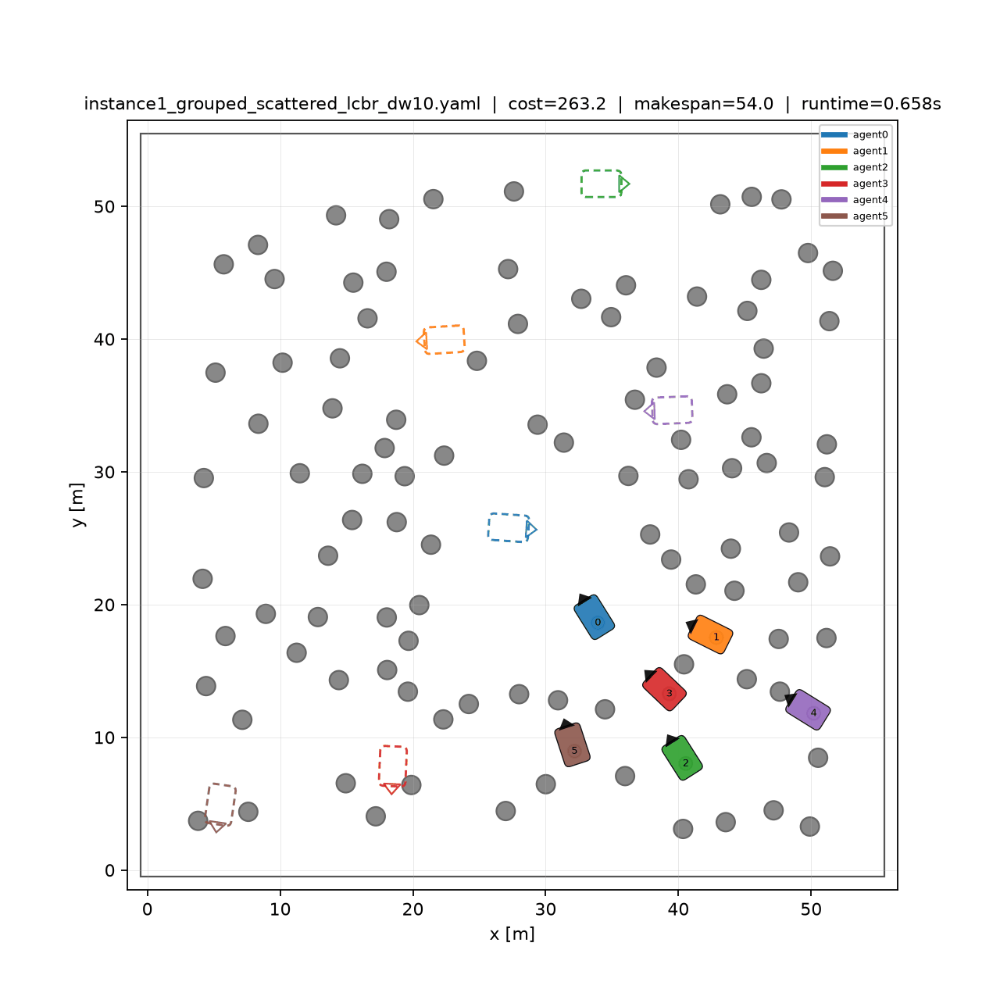
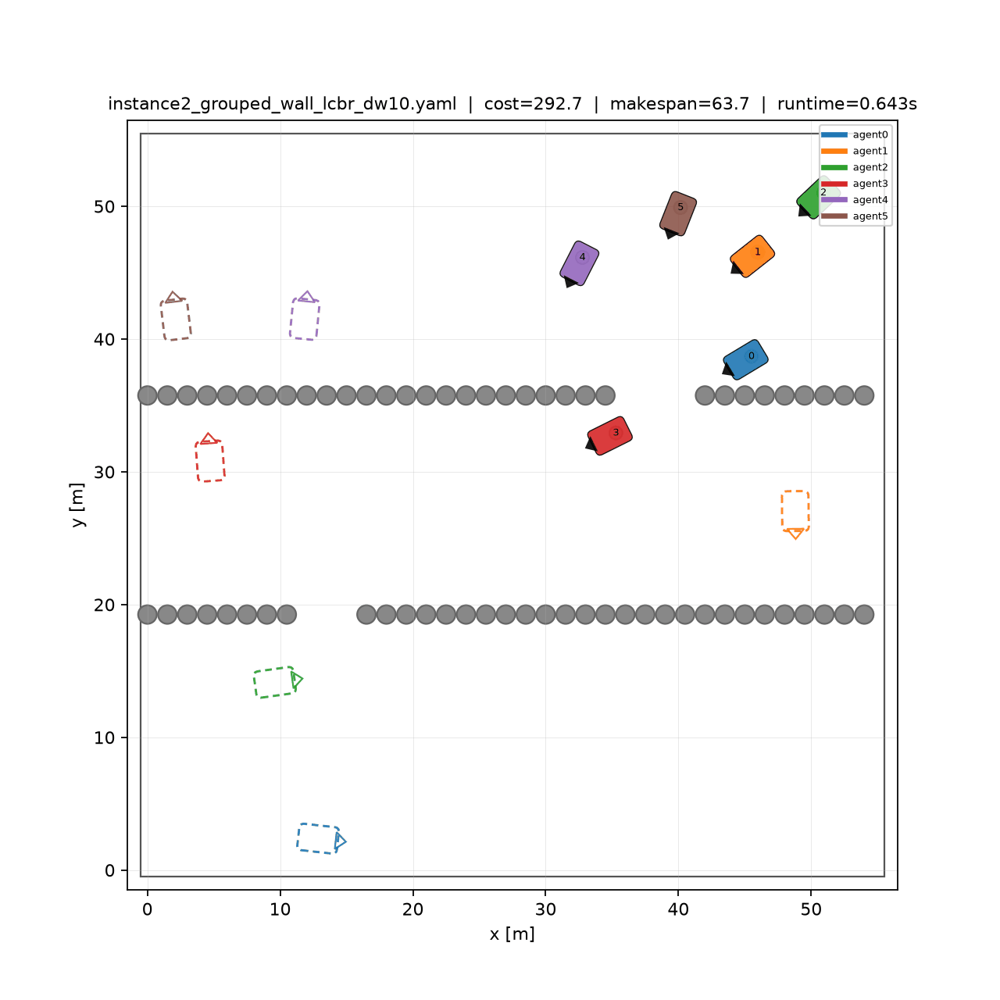
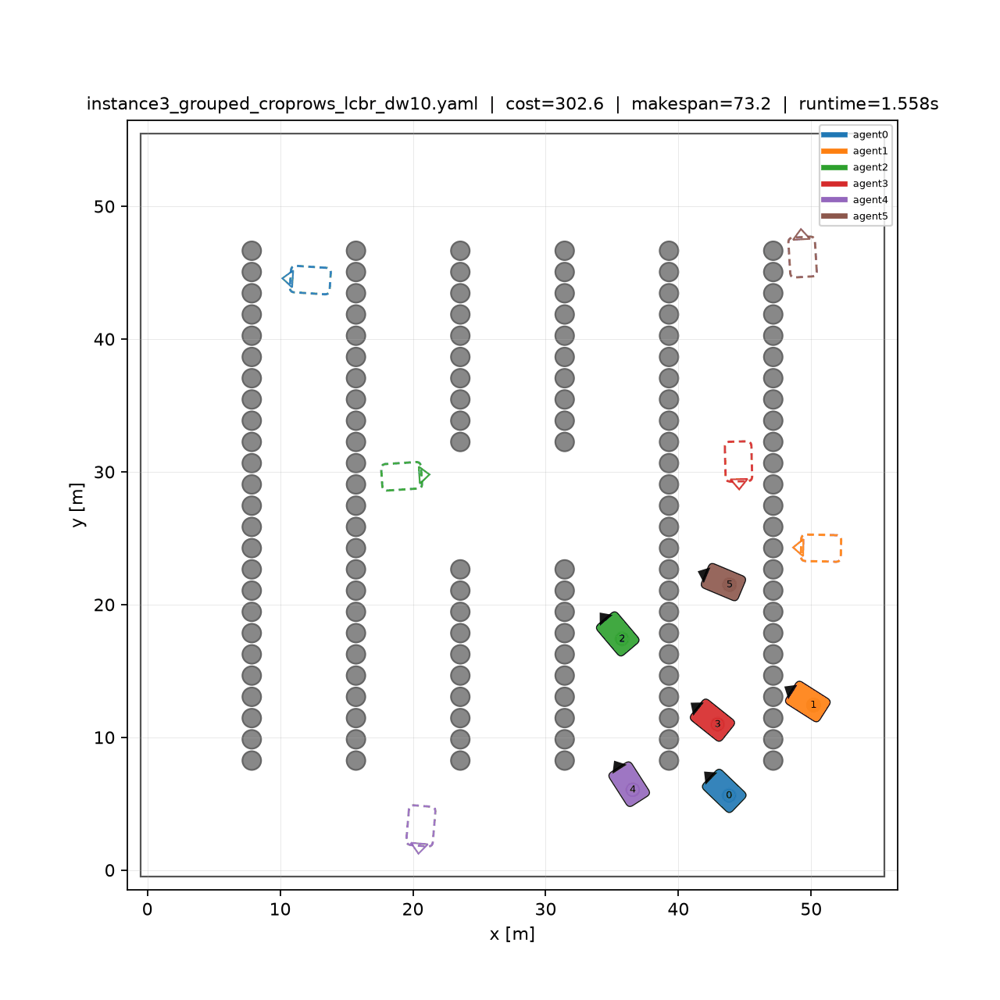

# LCBR — Multi-UGV Coordination and Gazebo Validation

**Local Conflict-Based Trajectory Repair (LCBR)** for coordinated motion planning of multiple Ackermann-steered UGVs, with an end-to-end execution and validation framework in **ROS 2 + Gazebo**.

This repository contains two complementary components:

1. **`algorithm/`** — planning and coordination:
   - SHA* nominal trajectory generation,
   - trajectory-cost-based task allocation,
   - CL-CBS baseline,
   - Local Conflict-Based Trajectory Repair (LCBR),
   - experimental evaluation and validation.

2. **`simulation/`** — execution and physical validation:
   - exact reconstruction of SHA* motion primitives,
   - dense trajectory generation,
   - synchronized multi-UGV temporal execution,
   - Pure Pursuit trajectory tracking,
   - Ackermann vehicle models,
   - ROS 2 / Gazebo simulation.

---

## LCBR Examples

<table align="center">
<tr>
  <th>Example A — Grouped / Scattered</th>
  <th>Example B — Grouped / Wall</th>
  <th>Example C — Grouped / Crop Rows</th>
</tr>

<tr>
  <td align="center">
    
  </td>

  <td align="center">
    
  </td>

  <td align="center">
    
  </td>
</tr>
</table>

<p align="center">
  <em>
    Three six-UGV examples through the complete Stage 1 → Stage 2 → Stage 3
    pipeline, showing the final coordinated trajectories obtained with LCBR
    using a bounded local repair window
    (<strong>δ<sub>w</sub> = 10</strong>).
  </em>
</p>

---

# Complete Framework

The complete workflow implemented in this repository is:

```text
Scenario
   │
   ▼
SHA* nominal trajectory generation
   │
   ▼
Trajectory-cost-based task allocation
   │
   ▼
Nominal multi-UGV trajectories
   │
   ▼
Conflict detection
   │
   ▼
CL-CBS or LCBR conflict resolution
   │
   ▼
final_lcbr.yaml
   │
   ▼
Exact SHA* primitive reconstruction
   │
   ▼
Dense trajectory references
   │
   ▼
Multi-UGV temporal scheduler
   │
   ▼
Pure Pursuit controllers
   │
   ▼
ROS 2 / Gazebo Ackermann execution
   │
   ▼
Odometry feedback
```

The planning and execution layers are intentionally separated:

```text
┌────────────────────────────────────────────┐
│                 algorithm/                 │
│                                            │
│  SHA*                                      │
│    ↓                                       │
│  Task Allocation                           │
│    ↓                                       │
│  Nominal Multi-UGV Trajectories            │
│    ↓                                       │
│  CL-CBS / LCBR                             │
│    ↓                                       │
│  final_lcbr.yaml                           │
└─────────────────────┬──────────────────────┘
                      │
                      │ trajectory interface
                      ▼
┌────────────────────────────────────────────┐
│                simulation/                 │
│                                            │
│  SHA* Primitive Reconstruction             │
│    ↓                                       │
│  Dense References                          │
│    ↓                                       │
│  Multi-UGV Temporal Scheduler              │
│    ↓                                       │
│  Pure Pursuit                              │
│    ↓                                       │
│  Ackermann Gazebo Models                   │
│    ↓                                       │
│  Physical Execution Validation             │
└────────────────────────────────────────────┘
```

---

# 1. Overview

The planning framework is built on top of **CL-CBS**:

> Wen et al., *CL-MAPF: Multi-Agent Path Finding for Car-Like Robots with Kinematic and Spatiotemporal Constraints*, Robotics and Autonomous Systems, 2022.

Original repository:

https://github.com/APRIL-ZJU/CL-CBS

The conflict-resolution stage supports two interchangeable strategies:

- **`clcbs`** — the CL-CBS baseline, using full-horizon low-level replanning for each Body Conflict Tree branch.

- **`lcbr`** — **Local Conflict-Based Trajectory Repair**, the proposed approach, which attempts bounded local replanning around a detected conflict while retaining full-horizon replanning as fallback.

Both approaches use the same Body Conflict Tree logic and the same SHA* low-level planning machinery.

The main experimental difference is therefore the replanning mechanism used after a conflict is detected.

The Gazebo component does **not** perform a second planning stage. It executes the trajectories generated by the planning framework using Ackermann vehicle models and closed-loop trajectory tracking.

---

# 2. Repository Structure

```text
UGV-Coordination/
│
├── README.md
├── LICENSE
├── CITATION.cff
├── .gitignore
│
├── algorithm/
│   │
│   ├── CMakeLists.txt
│   │
│   ├── include/
│   │   ├── body_conflict_tree.hpp
│   │   ├── environment.hpp
│   │   ├── experiment_logger.hpp
│   │   ├── hybrid_astar.hpp
│   │   ├── local_repair.hpp
│   │   ├── low_level_environment.hpp
│   │   ├── neighbor.hpp
│   │   ├── planresult.hpp
│   │   ├── task_allocation.hpp
│   │   └── timer.hpp
│   │
│   ├── src/
│   │   └── ugv_coordination.cpp
│   │
│   ├── config/
│   │   ├── vehicle_config.yaml
│   │   └── experiments/
│   │
│   ├── experiments/
│   │   ├── main_comparison/
│   │   ├── delta_w_ablation/
│   │   ├── full_pipeline/
│   │   └── real_instances/
│   │
│   ├── analysis/
│   ├── docs/
│   ├── results/
│   ├── tests/
│   ├── tools/
│   ├── benchmark/        # local dataset, not committed
│   └── runs/             # generated solutions, not committed
│
└── simulation/
    │
    └── src/
        └── ugv_gazebo/
            │
            ├── config/
            ├── launch/
            ├── models/
            ├── resource/
            ├── scenarios/
            ├── tools/
            ├── trajectories/
            ├── ugv_gazebo/
            ├── worlds/
            ├── package.xml
            ├── setup.py
            └── setup.cfg
```

The following generated ROS 2 directories are intentionally excluded from version control:

```text
simulation/build/
simulation/install/
simulation/log/
```

The original benchmark dataset and generated experiment solutions are also kept locally and excluded from Git.

---

# Part I — Planning and Coordination

# 3. Planning Pipeline

The algorithm implements three main stages.

## Stage 1 — Nominal Trajectory Generation

For every UGV–POI pair, SHA* computes a kinematically feasible trajectory and its corresponding path length.

For \(M\) robots and \(Q\) POIs, this produces an \(M \times Q\) trajectory-cost matrix:

\[
L_{ij},
\]

where \(L_{ij}\) is the SHA*-derived path cost for assigning robot \(i\) to POI \(j\).

This stage therefore accounts for the actual kinematic feasibility of the car-like UGV rather than relying only on Euclidean distance.

---

## Stage 2 — Task Allocation

The assignment problem is solved using the Hungarian algorithm.

The assignment objective is based on the actual SHA*-derived trajectory costs.

The resulting robot-to-POI assignment determines the nominal trajectory set:

\[
\Gamma^0.
\]

At this point, each UGV has a nominal kinematically feasible trajectory toward its assigned goal.

However, the trajectories have not yet been coordinated with respect to inter-robot conflicts.

---

## Stage 3 — Multi-UGV Conflict Resolution

The nominal trajectories are checked for spatiotemporal conflicts.

Two conflict-resolution strategies are available.

### CL-CBS baseline

```text
--mode clcbs
```

The baseline performs full-horizon low-level replanning when a constraint is introduced in the Body Conflict Tree.

### LCBR

```text
--mode lcbr
```

LCBR attempts to repair the affected portion of the trajectory within a bounded local temporal window controlled by:

\[
\delta_w.
\]

If the bounded local repair cannot produce a valid solution, the original full-horizon replanning mechanism remains available as fallback.

---

# 4. Relationship to CL-CBS

| File | Status |
|---|---|
| `algorithm/include/neighbor.hpp` | CL-CBS low-level machinery |
| `algorithm/include/planresult.hpp` | CL-CBS low-level machinery |
| `algorithm/include/timer.hpp` | CL-CBS utility |
| `algorithm/include/hybrid_astar.hpp` | SHA* low-level planning machinery, with documented defensive/experimental additions |
| `algorithm/include/environment.hpp` | adapted for local-goal override, instrumentation and state-validity access |
| `algorithm/include/low_level_environment.hpp` | shared low-level environment |
| `algorithm/include/task_allocation.hpp` | nominal generation and task allocation |
| `algorithm/include/local_repair.hpp` | LCBR implementation |
| `algorithm/include/body_conflict_tree.hpp` | Body Conflict Tree with runtime-selectable low-level strategy |
| `algorithm/include/experiment_logger.hpp` | experiment/query logging |
| `algorithm/src/ugv_coordination.cpp` | complete Stage 1 → 2 → 3 pipeline |
| `algorithm/tools/visualize.py` | original visualization utility |
| `algorithm/tools/visualize_v2.py` | extended visualization, static plots, solver comparison and GIF export |

Additional implementation details are available in:

- [`algorithm/docs/LCBR.md`](algorithm/docs/LCBR.md)
- [`algorithm/docs/EXPERIMENTS.md`](algorithm/docs/EXPERIMENTS.md)
- [`algorithm/docs/REPRODUCIBILITY.md`](algorithm/docs/REPRODUCIBILITY.md)

---

# 5. Build the Algorithm

## Dependencies

On Ubuntu:

```bash
sudo apt-get install \
    g++ \
    cmake \
    libboost-program-options-dev \
    libyaml-cpp-dev \
    libompl-dev \
    libeigen3-dev
```

## Build

From the repository root:

```bash
cd algorithm

mkdir -p build
cd build

cmake -DCMAKE_BUILD_TYPE=Release ..

make -j$(nproc)

ctest --output-on-failure
```

The main executable is:

```text
algorithm/build/ugv_coordination
```

---

# 6. Example Planner Execution

From:

```bash
cd algorithm
```

run:

```bash
mkdir -p runs/full_pipeline/corridors_6ugv

./build/ugv_coordination \
  --input experiments/full_pipeline/instances/paper_corridors_6ugv.yaml \
  --output runs/full_pipeline/corridors_6ugv/final_lcbr.yaml \
  --nominal-output runs/full_pipeline/corridors_6ugv/nominal.yaml \
  --mode lcbr \
  --delta_w_steps 10 \
  --timeout 600 \
  --vehicle-config config/vehicle_config.yaml
```

This produces:

```text
nominal.yaml
    │
    └── nominal trajectories before conflict resolution

final_lcbr.yaml
    │
    └── final coordinated trajectories after LCBR
```

---

# 7. Visualization — Before and After LCBR

The primary visualization utility is:

```text
algorithm/tools/visualize_v2.py
```

It supports static trajectory figures, animated videos, GIF export and solver comparison.

## Before LCBR

```bash
python3 tools/visualize_v2.py \
  -m experiments/full_pipeline/instances/paper_corridors_6ugv.yaml \
  -s runs/full_pipeline/corridors_6ugv/nominal.yaml \
  -v runs/full_pipeline/corridors_6ugv/corridors_6ugv_BEFORE.gif \
  --speed 4
```

## After LCBR

```bash
python3 tools/visualize_v2.py \
  -m experiments/full_pipeline/instances/paper_corridors_6ugv.yaml \
  -s runs/full_pipeline/corridors_6ugv/final_lcbr.yaml \
  -v runs/full_pipeline/corridors_6ugv/corridors_6ugv_AFTER.gif \
  --speed 4
```

`--speed` modifies only the animation playback speed. It does not modify the planned trajectories or their temporal structure.

---

# 8. Main Command-Line Options

| Flag | Meaning |
|---|---|
| `-i, --input` | input scenario YAML |
| `-o, --output` | final solution YAML |
| `--nominal-output` | nominal trajectory set before conflict resolution |
| `-m, --mode` | `clcbs` or `lcbr` |
| `--delta_w_steps` | LCBR repair margin in \(T_s\) steps |
| `--timeout` | Stage-3 wall-clock budget |
| `--max-low-level-expansions` | maximum SHA* expansions for one low-level query |
| `--cost-matrix-csv` | export the \(M \times Q\) SHA* trajectory-cost matrix |
| `--assignment-csv` | export the resolved robot-to-POI assignment |
| `--instance-id` | experiment identifier |
| `--log-dir` | directory for experiment logs |
| `--vehicle-config` | vehicle/algorithm configuration |

---

# Part II — Planner-to-Gazebo Execution

# 9. Purpose of the Simulation Layer

The simulation layer evaluates the execution of the trajectories generated by the planning framework using Ackermann-steered vehicle models.

The simulation does not replace:

- SHA*,
- task allocation,
- CL-CBS,
- LCBR.

Instead:

```text
Planning layer
    │
    └── determines WHERE and WHEN the UGV should move

Execution layer
    │
    └── determines HOW the physical Ackermann model follows the reference
```

The execution architecture is:

```text
final_lcbr.yaml
       │
       ▼
Exact SHA* primitive reconstruction
       │
       ▼
Dense trajectory references
       │
       ▼
Multi-UGV temporal scheduler
       │
       ▼
Pure Pursuit
       │
       ▼
(v, omega)
       │
       ▼
Gazebo Ackermann Steering
       │
       ▼
Vehicle physics
       │
       ▼
Odometry
       │
       └──────────────► closed-loop feedback
```

---

# 10. Planner-to-Simulation Interface

The interface between the planning and execution layers is:

```text
final_lcbr.yaml
```

For each agent, the trajectory contains states of the form:

```yaml
x: ...
y: ...
yaw: ...
t: ...
action: ...
```

The state provides:

- position \(x,y\),
- vehicle orientation `yaw`,
- discrete planning time \(t\),
- the SHA* motion primitive used for the next transition.

The execution layer interprets the actions as:

| Action | Motion class | Direction |
|---:|---|---|
| 0 | straight | forward |
| 1 | turning primitive | forward |
| 2 | turning primitive | forward |
| 3 | straight | reverse |
| 4 | turning primitive | reverse |
| 5 | turning primitive | reverse |
| 6 | stationary primitive | WAIT |

The `action` field is therefore essential for reproducing the original SHA* motion rather than treating the YAML states as arbitrary geometric waypoints.

---

# 11. Dense SHA* Primitive Reconstruction

The states contained in `final_lcbr.yaml` are discrete planner states.

They are **not** connected using arbitrary straight-line interpolation.

Instead:

```text
simulation/src/ugv_gazebo/ugv_gazebo/dense_reference.py
```

reconstructs the geometry of each original SHA* primitive.

Run:

```bash
cd simulation/src/ugv_gazebo

python3 ugv_gazebo/dense_reference.py
```

The current implementation samples each primitive into multiple intermediate reference points.

For turning primitives, the reconstruction uses the same minimum turning radius as the planner:

\[
R = 3\,\mathrm{m}.
\]

For an intermediate angular displacement \(\delta\psi\), the local circular motion is reconstructed from:

\[
dx_{\mathrm{local}}
=
R\sin(|\delta\psi|),
\]

and:

\[
dy_{\mathrm{local}}
=
\pm R\left(1-\cos(|\delta\psi|)\right).
\]

The sign depends on the corresponding SHA* primitive.

For reverse primitives, the longitudinal displacement is reversed.

The local displacement is then transformed into the planner/world coordinate frame using the starting yaw of the primitive.

For straight primitives, intermediate states are sampled along the original straight motion.

For a WAIT primitive:

\[
x_j=x_0,
\]

\[
y_j=y_0,
\]

\[
\psi_j=\psi_0,
\]

while time continues to advance.

The generated dense references are:

```text
trajectories/dense/
├── agent0_dense.yaml
├── agent1_dense.yaml
├── agent2_dense.yaml
├── agent3_dense.yaml
├── agent4_dense.yaml
└── agent5_dense.yaml
```

The reconstruction includes an endpoint audit that compares each analytically reconstructed primitive endpoint with the original SHA* endpoint.

This ensures that densification samples the planner trajectory rather than introducing a new path.

---

# 12. From Planner Output to Gazebo

A new LCBR solution can be transferred to the simulation package using:

```bash
cp \
algorithm/runs/full_pipeline/corridors_6ugv/final_lcbr.yaml \
simulation/src/ugv_gazebo/trajectories/final_lcbr.yaml
```

Then regenerate the dense references:

```bash
cd simulation/src/ugv_gazebo

python3 ugv_gazebo/dense_reference.py
```

The complete interface is therefore:

```text
algorithm/
   │
   └── runs/.../final_lcbr.yaml
                   │
                   ▼
simulation/
   │
   └── trajectories/final_lcbr.yaml
                   │
                   ▼
             dense_reference.py
                   │
                   ▼
       agent0_dense.yaml
       agent1_dense.yaml
       ...
       agent5_dense.yaml
```

---

# 13. Gazebo Scenario Generation

For the six-UGV corridor experiment:

```bash
cd simulation/src/ugv_gazebo

python3 tools/generate_corridors_world.py
```

The script uses:

```text
scenarios/paper_corridors_6ugv.yaml
```

and generates:

```text
worlds/paper_corridors_6ugv.sdf
```

The current corridor scenario contains:

```text
Workspace : 55 x 55 m
Obstacles : 92
Starts    : 6
Goals     : 6
```

The planner-to-Gazebo start mapping is:

| Planner agent | Gazebo model | Start |
|---|---|---|
| `agent0` | `ugv_1` | `(12, 4)` |
| `agent1` | `ugv_2` | `(18, 4)` |
| `agent2` | `ugv_3` | `(24, 4)` |
| `agent3` | `ugv_4` | `(30, 4)` |
| `agent4` | `ugv_5` | `(36, 4)` |
| `agent5` | `ugv_6` | `(42, 4)` |

---

# 14. Ackermann Vehicle Model

Each simulated UGV uses an Ackermann steering model.

The principal vehicle parameters are:

```text
wheel base       = 1.30 m
wheel separation = 1.16 m
wheel radius     = 0.25 m
turning radius   = 3.0 m
```

The Gazebo steering limit is selected consistently with the planner minimum turning radius.

The vehicle model uses the rear axle center as the reference convention to remain consistent with the planning state representation.

Each UGV exposes independent ROS/Gazebo interfaces:

```text
/ugv_1/cmd_vel
/model/ugv_1/odometry

/ugv_2/cmd_vel
/model/ugv_2/odometry

...

/ugv_6/cmd_vel
/model/ugv_6/odometry
```

---

# 15. Closed-Loop Pure Pursuit Tracking

Each robot is controlled independently using a Pure Pursuit trajectory tracker.

The controller receives:

```text
dense trajectory reference
        +
Gazebo odometry
```

and computes a longitudinal and angular command:

\[
(v,\omega).
\]

For a target point with heading error \(\alpha\) and lookahead distance \(L_d\), the Pure Pursuit curvature is based on:

\[
\kappa
=
\frac{2\sin(\alpha)}{L_d}.
\]

The angular command is related to the longitudinal velocity through:

\[
\omega = v\kappa.
\]

The resulting command is sent to the corresponding Gazebo Ackermann steering system.

The controller therefore operates in closed loop:

```text
Dense reference
      │
      ▼
Pure Pursuit
      │
      ▼
(v, omega)
      │
      ▼
Ackermann model
      │
      ▼
Gazebo physics
      │
      ▼
Odometry
      │
      └────────────► Pure Pursuit
```

---

# 16. Forward and Reverse Execution

The direction of motion is preserved from the SHA* primitive.

For forward primitives:

\[
v>0.
\]

For reverse primitives:

\[
v<0.
\]

Direction changes are handled explicitly by the execution layer.

Typical transitions are:

```text
forward
   ↓
stop
   ↓
reverse
```

or:

```text
reverse
   ↓
stop
   ↓
forward
```

This prevents the controller from treating forward and reverse portions of the planner trajectory as equivalent geometric segments.

---

# 17. WAIT Execution

An LCBR WAIT action corresponds to:

```text
action = 6
```

During WAIT:

\[
v=0,
\qquad
\omega=0.
\]

The vehicle remains at the same physical pose while planning time advances.

The execution layer explicitly detects contiguous WAIT intervals and releases the robot once the scheduled WAIT interval has elapsed.

Typical log messages include:

```text
LCBR WAIT
WAIT RELEASE
```

WAIT is therefore treated as a temporal coordination primitive rather than as a duplicated geometric waypoint.

---

# 18. Multi-UGV Temporal Coordination

Geometric trajectory tracking alone is insufficient for executing a multi-robot LCBR solution.

LCBR contains temporal coordination decisions that must also be preserved during physical execution.

The multi-UGV execution layer therefore preserves:

- forward motion,
- reverse motion,
- WAIT actions,
- WAIT release,
- direction switches,
- temporal-frontier constraints.

Gazebo odometry timestamps provide a common simulation-time basis for all six UGVs.

If a robot reaches a future part of its trajectory before that part is temporally admissible, it is stopped at the current temporal frontier.

Typical logs include:

```text
TIME FRONTIER HOLD
```

The execution architecture therefore attempts to preserve both:

```text
geometric reference
        +
temporal coordination
```

from the LCBR solution.

---

# 19. Multi-UGV Tracker

The multi-UGV execution node is:

```text
simulation/src/ugv_gazebo/ugv_gazebo/multi_ugv_tracker.py
```

The mapping is:

```text
agent0_dense.yaml -> ugv_1
agent1_dense.yaml -> ugv_2
agent2_dense.yaml -> ugv_3
agent3_dense.yaml -> ugv_4
agent4_dense.yaml -> ugv_5
agent5_dense.yaml -> ugv_6
```

The node simultaneously manages:

```text
6 trajectory references
6 odometry streams
6 command publishers
6 Pure Pursuit controllers
1 common temporal coordination mechanism
```

---

# 20. Build the ROS 2 / Gazebo Simulation

Requirements include:

- Ubuntu,
- ROS 2 Jazzy,
- Gazebo / Gazebo Sim,
- `ros_gz_bridge`.

From the repository root:

```bash
cd simulation

source /opt/ros/jazzy/setup.bash

colcon build \
  --packages-select ugv_gazebo \
  --symlink-install

source install/setup.bash
```

Generated directories:

```text
simulation/build/
simulation/install/
simulation/log/
```

are ignored by Git.

---

# 21. Launch the Gazebo Simulation

## Terminal 1 — Gazebo + six UGVs + ROS/Gazebo bridge

From:

```bash
cd simulation
```

run:

```bash
source /opt/ros/jazzy/setup.bash
source install/setup.bash

ros2 launch ugv_gazebo simulation.launch.py
```

Wait until all six UGVs are visible.

---

## Terminal 2 — Start Multi-UGV Execution

Open a second terminal:

```bash
cd simulation

source /opt/ros/jazzy/setup.bash
source install/setup.bash

ros2 run ugv_gazebo multi_ugv_tracker
```

A successful execution terminates with:

```text
MULTI-UGV MISSION END | complete=6/6 | failed=0/6
```

---

# 22. Gazebo Simulation Speed

The Gazebo world contains:

```xml
<max_step_size>...</max_step_size>
<real_time_factor>...</real_time_factor>
```

`real_time_factor` defines a **target** simulation acceleration.

The actual achievable factor depends on:

- CPU performance,
- Gazebo physics computation,
- rendering cost,
- number of simulated models,
- number of obstacles.

The actual Gazebo real-time factor can be measured using:

```bash
gz topic -l | grep stats
```

and:

```bash
gz topic -e \
  -t /world/paper_corridors_6ugv/stats
```

For high-throughput experiments, Gazebo can also be executed without the graphical client:

```bash
gz sim -r -s <world.sdf>
```

This preserves the simulation server and physics while removing GUI rendering overhead.

---

# Part III — Experiments and Reproducibility

# 23. Main CL-CBS vs LCBR Comparison

From:

```bash
cd algorithm/experiments/main_comparison
```

run:

```bash
python3 select_instances.py \
  --config ../../config/experiments/main_comparison_50x50.yaml \
  --tag 50

python3 run_comparison.py \
  --config ../../config/experiments/main_comparison_50x50.yaml \
  --tag 50
```

The corresponding configurations are available for:

```text
50 x 50
100 x 100
300 x 300
```

instances.

---

# 24. Repair-Window Ablation

For the LCBR repair-window analysis:

```bash
cd algorithm/experiments/delta_w_ablation

python3 select_conflict_instances.py \
  --map-size 100by100 \
  --scenario obstacle \
  --top-n 15 \
  --tag 100conf

python3 run_ablation.py \
  --config ../../config/experiments/delta_w_ablation_100x100.yaml \
  --tag 100conf \
  --parallel 3
```

---

# 25. Solution Validation

The generated solutions can be independently validated using:

```bash
cd algorithm/analysis

python3 validate_all_runs.py \
  --vehicle-config ../config/vehicle_config.yaml
```

The validation framework checks the relevant:

- kinematic conditions,
- obstacle/boundary conditions,
- inter-robot collision conditions.

---

# 26. Benchmark Dataset

The original Wen et al. benchmark is **not stored in this repository**.

Place it locally under:

```text
algorithm/benchmark/
```

The directory is excluded through `.gitignore`.

This avoids committing thousands of benchmark files that are publicly available upstream.

---

# 27. Generated Experiment Results

Generated experiment outputs are stored locally under:

```text
algorithm/runs/
```

and are not committed.

The repository keeps only:

```text
algorithm/runs/.gitkeep
```

The generated ROS 2 artifacts are similarly excluded:

```text
simulation/build/
simulation/install/
simulation/log/
```

The simulation source package, reference scenario and reference trajectories remain versioned to support reproducibility.

---

# 28. Documentation

Algorithm-specific documentation is available under:

```text
algorithm/docs/
```

Main documents:

- [`LCBR.md`](algorithm/docs/LCBR.md) — algorithm-to-code mapping and LCBR details,
- [`EXPERIMENTS.md`](algorithm/docs/EXPERIMENTS.md) — experiment execution,
- [`REPRODUCIBILITY.md`](algorithm/docs/REPRODUCIBILITY.md) — environment, limitations and reproducibility notes.

---

# 29. Reproducibility Workflow

A complete reproduction of the planning-to-simulation pipeline follows:

```text
1. Obtain / generate scenario
          │
          ▼
2. Run SHA* + task allocation
          │
          ▼
3. Generate nominal.yaml
          │
          ▼
4. Run LCBR
          │
          ▼
5. Generate final_lcbr.yaml
          │
          ▼
6. Copy final_lcbr.yaml to simulation package
          │
          ▼
7. Run dense_reference.py
          │
          ▼
8. Verify primitive endpoint audit
          │
          ▼
9. Generate Gazebo world
          │
          ▼
10. Build ROS 2 package
          │
          ▼
11. Launch Gazebo
          │
          ▼
12. Launch multi_ugv_tracker
          │
          ▼
13. Verify all six UGVs complete
```

Expected final execution status:

```text
MULTI-UGV MISSION END | complete=6/6 | failed=0/6
```

---

# 30. Interpretation of the Gazebo Validation

The Gazebo simulation should be interpreted as an **execution-level validation** of trajectories generated by the planning framework.

The planning layer determines:

```text
where each UGV should move
+
which forward/reverse/WAIT primitives should be executed
+
the temporal coordination between robots
```

The execution layer determines:

```text
how a physical Ackermann vehicle follows that reference
```

Therefore:

```text
Planning / Coordination
          │
          │ final_lcbr.yaml
          ▼
Physical Execution
```

are deliberately separated.

This distinction is important when interpreting:

- planning feasibility,
- collision-free coordination,
- physical tracking errors,
- execution timing,
- controller behavior,
- simulation-level deviations.

---

# 31. Project Status

Current development includes:

- SHA* nominal trajectory generation,
- trajectory-cost-based task allocation,
- CL-CBS baseline,
- Local Conflict-Based Trajectory Repair,
- experiment logging,
- solution validation,
- 50×50 experiment infrastructure,
- 100×100 experiment infrastructure,
- 300×300 experiment infrastructure,
- six-UGV ROS 2 / Gazebo execution,
- exact SHA* primitive reconstruction,
- forward motion execution,
- reverse motion execution,
- explicit WAIT handling,
- WAIT release,
- temporal-frontier synchronization,
- closed-loop Pure Pursuit tracking,
- Ackermann vehicle models,
- accelerated Gazebo execution.

The repository is currently maintained as a research codebase associated with ongoing work.

---

# 32. Citation

See:

[`CITATION.cff`](CITATION.cff)

If using the underlying CL-CBS / CL-MAPF machinery, please also cite the original work:

> Wen et al., *CL-MAPF: Multi-Agent Path Finding for Car-Like Robots with Kinematic and Spatiotemporal Constraints*, Robotics and Autonomous Systems, 2022.

Original CL-CBS repository:

https://github.com/APRIL-ZJU/CL-CBS

---

# 33. License

See:

[`LICENSE`](LICENSE)

for licensing information.