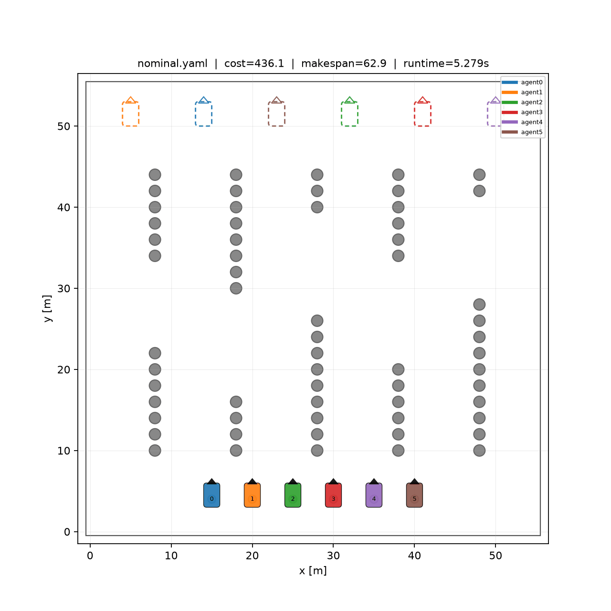
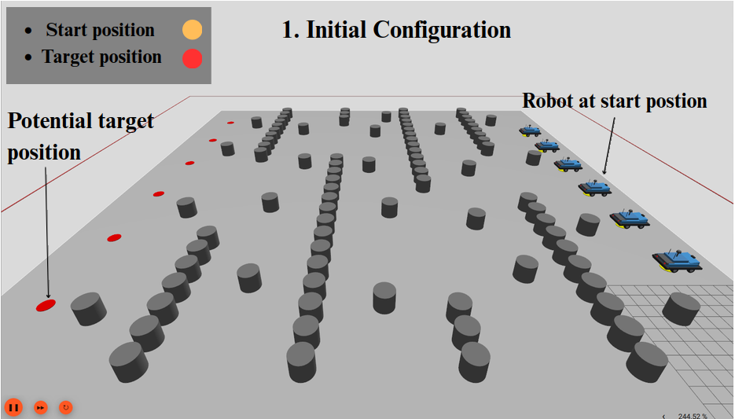
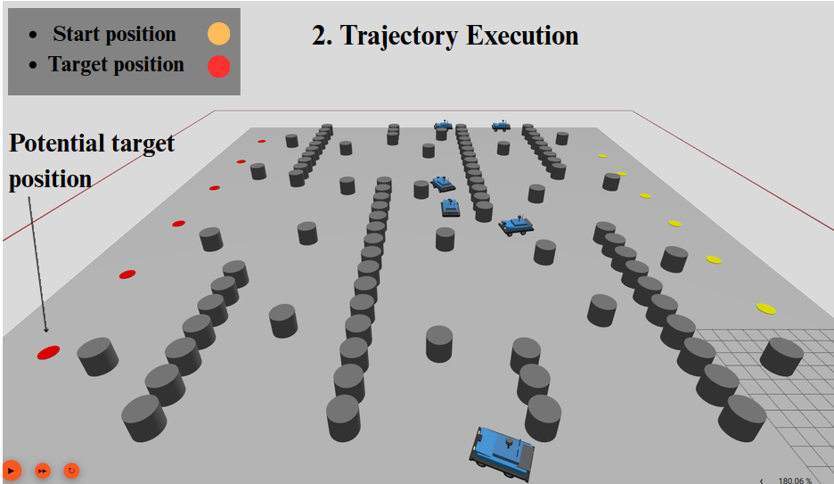
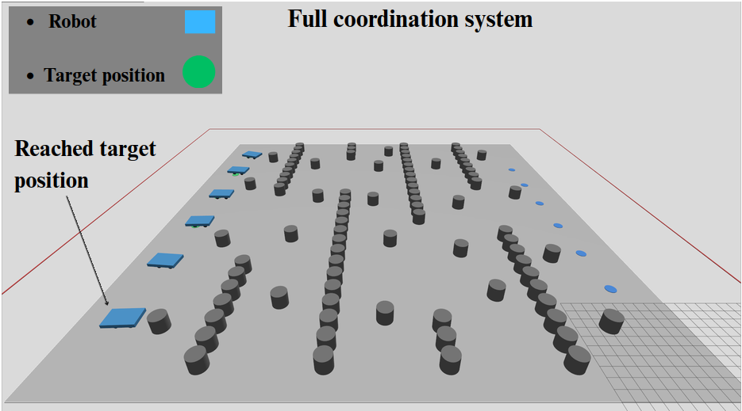

# LCBR — Local Conflict-Based Trajectory Repair

This repository provides the implementation of **Local Conflict-Based Trajectory Repair (LCBR)** for coordinating fleets of Ackermann-steered unmanned ground vehicles (UGVs).

LCBR is a localized low-level replanning mechanism for **Car-Like Conflict-Based Search (CL-CBS)**. Instead of replanning the complete trajectory of a constrained vehicle after every detected conflict, LCBR first attempts to repair only a bounded temporal segment around the conflict while preserving the unaffected portions of the trajectory. Full-horizon SHA* replanning is retained as fallback whenever local repair is infeasible or inapplicable.

The repository implements the complete coordination pipeline used in the study:

```text
SHA* trajectory generation
        ↓
Trajectory-aware task assignment
        ↓
Nominal multi-UGV trajectories
        ↓
CL-CBS / LCBR conflict resolution
        ↓
Collision-free trajectories
```

A ROS 2 / Gazebo implementation is also included for qualitative execution validation of the resulting trajectories with Ackermann-steered UGV models.

---

## Method Overview

Given a fleet of car-like UGVs and a set of points of interest (POIs), the framework operates sequentially in three stages.

**1. Nominal trajectory generation.**  
SHA* computes a kinematically feasible candidate trajectory for each robot–POI pair.

**2. Task assignment.**  
The Hungarian algorithm determines a one-to-one robot–POI assignment using the SHA*-derived trajectory costs.

**3. Conflict resolution.**  
The assigned trajectories are coordinated using either:

- **CL-CBS** — full-horizon replanning of the constrained vehicle; or
- **LCBR** — bounded temporal repair around the selected conflict, with full-horizon replanning retained as fallback.

LCBR preserves the CL-CBS high-level Body Conflict Tree (BCT) structure and SHA* low-level planner. Its contribution is the temporal localization of conflict-triggered low-level replanning.

---

## LCBR Example

The following example illustrates the effect of conflict resolution on the
multi-UGV trajectories. The first animation shows the nominal trajectories
after task assignment, which may contain inter-robot conflicts. The second
shows the collision-free trajectories obtained after LCBR.

<table align="center">
<tr>
  <th>Before LCBR</th>
  <th>After LCBR</th>
</tr>
<tr>
  <td align="center">
    
  </td>
  <td align="center">
    
  </td>
</tr>
</table>

---

## Repository Structure

```text
UGV-Coordination/
├── algorithm/
│   ├── include/          # CL-CBS, SHA*, LCBR and task allocation
│   ├── src/              # main coordination executable
│   ├── config/           # vehicle and experiment configurations
│   ├── experiments/      # experiment runners and frozen instance lists
│   ├── tests/            # automated tests
│   ├── tools/            # visualization utilities
│   └── docs/             # additional LCBR implementation notes
│
├── simulation/
│   └── src/ugv_gazebo/   # ROS 2 / Gazebo qualitative validation
│
├── CITATION.cff
├── LICENSE
└── README.md
```

The original benchmark dataset, generated experiment runs, build artifacts, and analysis notebooks are intentionally not included in the public repository.

---

## Dependencies

The planning implementation has been tested with:

- Ubuntu Linux
- GCC 13 / C++14
- CMake
- Boost 1.83
- OMPL 1.5
- yaml-cpp 0.8
- Eigen3

Install the main Ubuntu dependencies with:

```bash
sudo apt-get install \
    g++ \
    cmake \
    libboost-program-options-dev \
    libyaml-cpp-dev \
    libompl-dev \
    libeigen3-dev
```

---

## Build and Test

From the repository root:

```bash
cd algorithm

cmake -S . -B build -DCMAKE_BUILD_TYPE=Release
cmake --build build -j"$(nproc)"
```

Run the automated tests with:

```bash
ctest --test-dir build --output-on-failure
```

The main executable is:

```text
algorithm/build/ugv_coordination
```

---

## Running LCBR

A complete example can be executed from `algorithm/`:

```bash
mkdir -p runs/full_pipeline/corridors_6ugv

./build/ugv_coordination \
  --input experiments/full_pipeline/instances/paper_corridors_6ugv.yaml \
  --output runs/full_pipeline/corridors_6ugv/final_lcbr.yaml \
  --nominal-output runs/full_pipeline/corridors_6ugv/nominal.yaml \
  --mode lcbr \
  --delta_w_steps 10 \
  --timeout 600 \
  --vehicle-config config/vehicle_config.yaml
```

The corresponding CL-CBS baseline is selected with:

```text
--mode clcbs
```

The main LCBR parameter is `--delta_w_steps`, which controls the temporal repair margin.

Additional implementation details are provided in [`algorithm/docs/LCBR.md`](algorithm/docs/LCBR.md).

---

## Reproducing the Experiments

The experimental configurations used for the CL-CBS/LCBR comparison are available under:

```text
algorithm/config/experiments/
```

Frozen instance lists used by the experimental campaigns are stored under:

```text
algorithm/experiments/main_comparison/
```

The repository contains configurations and frozen instance lists for the **50x50**, **100x100**, and **300x300** map scales used in the study.

For example:

```bash
cd algorithm/experiments/main_comparison

python3 run_comparison.py \
  --config ../../config/experiments/main_comparison_50x50.yaml \
  --tag final50_50x50
```

Generated experiment outputs are written under:

```text
algorithm/runs/
```

and are intentionally excluded from version control.

### Repair-window sensitivity

The repair-window experiments are implemented under:

```text
algorithm/experiments/delta_w_ablation/
```

The study evaluates multiple repair-window sizes to characterize the trade-off between localized search effort and repair robustness.

The public repository provides the implementation, experiment configurations, and frozen instance selections. Analysis notebooks and generated experimental logs are kept separately and can be provided when needed.

---

## Benchmark Dataset

The experiments use the car-like multi-agent benchmark associated with the original **CL-CBS / CL-MAPF** work by Wen et al.

The benchmark files are not redistributed in this repository.

After obtaining the original dataset, place it under:

```text
algorithm/benchmark/
```

so that the experiment configuration paths resolve as:

```text
algorithm/benchmark/map50by50/
algorithm/benchmark/map100by100/
algorithm/benchmark/map300by300/
```

Original CL-CBS repository:

https://github.com/APRIL-ZJU/CL-CBS

---

## ROS 2 / Gazebo Validation

The `simulation/` directory provides qualitative execution validation of LCBR trajectories using Ackermann-steered UGV models in ROS 2 and Gazebo.

The simulation layer does **not** perform additional trajectory planning. It executes trajectories generated by the planning framework through reconstruction of the SHA* motion primitives, synchronized temporal execution, and closed-loop trajectory tracking.

### Simulation Demo

A complete Gazebo execution of the coordinated six-UGV mission is available below:

[▶ **Watch the Gazebo simulation**](simulation/src/ugv_gazebo/Docs/gazebo-simulation.webm)

### Gazebo Examples

<table align="center">
<tr>
  <th><big>Initial Configuration</big></th>
  <th><big>Trajectory Execution</big></th>
  <th><big>Mission Completed</big></th>
</tr>
<tr>
  <td align="center">
    
  </td>
  <td align="center">
    
  </td>
  <td align="center">
    
  </td>
</tr>
</table>


### Simulation Requirements

The simulation was developed with:

- ROS 2 Jazzy
- Gazebo Sim
- `ros_gz_bridge`

Build the simulation package from the repository root:

```bash
cd simulation

source /opt/ros/jazzy/setup.bash

colcon build \
  --packages-select ugv_gazebo \
  --symlink-install

source install/setup.bash
```

Launch Gazebo:

```bash
ros2 launch ugv_gazebo simulation.launch.py
```

In a second terminal:

```bash
cd simulation

source /opt/ros/jazzy/setup.bash
source install/setup.bash

ros2 run ugv_gazebo multi_ugv_tracker
```

The Gazebo experiments are intended as **qualitative execution validation**, not as a quantitative dynamic-fidelity evaluation of the planning model.

---

---

## Citation

Citation metadata for this software is provided in [`CITATION.cff`](CITATION.cff).

Associated manuscript:

> **Local Conflict-Based Trajectory Repair for Coordinating Fleets of Car-Like Unmanned Ground Vehicles**  
> Batbaina Guikoura, Daniel Bonilla Licea, and Giuseppe Silano.

The manuscript is currently under submission. Publication metadata will be added after acceptance.

---

## License

See [`LICENSE`](LICENSE).
